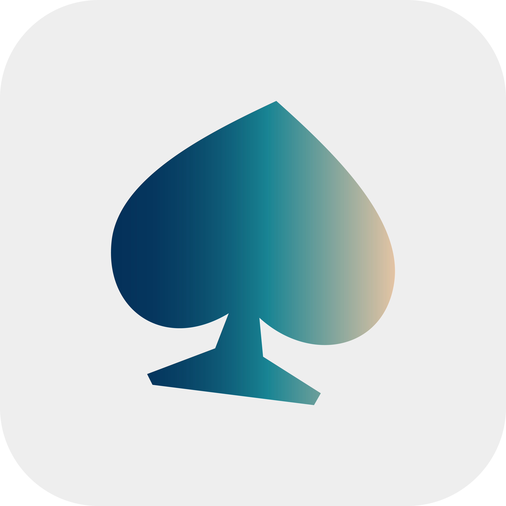

<div align="center">



# HerdrBell

**A tiny macOS menu bar bell for your [herdr](https://herdr.dev) coding agents.**

Glance at the menu bar to see which agents are working, which are done,
and which are blocked waiting for *you* — then jump straight to the pane
with one click.


</div>

---

## 🔔 Install it, and just look up

**There is nothing to configure.** Drop HerdrBell in your Applications
folder, launch it, and it silently finds every **running herdr server** on
your machine — along with all of its **sessions, workspaces, and agents** —
all by itself. No setup files, no CLI wiring, no paths to paste.

From that moment on, the menu bar icon *is* your status dashboard:

-  **Blocked** (red) — an agent is blocked and waiting on **you**
-  **Working** (blue) — agents are working
-  **Done** (green) — work finished, waiting to be reviewed
-  **Idle** (gray) — everyone is idle
-  **Disconnected** — no herdr running right now

One glance tells you whether it's safe to make coffee. One click opens the
full per-session agent list; one more click jumps straight to that agent's
pane. That's the whole product.

## ✨ What it does

- **Live agent status in your menu bar** — every agent running in herdr,
  grouped by session, with a status icon per agent.
- **One aggregate icon** — the menu bar symbol reflects the most urgent
  status across all connected sessions, so a single glance is enough.
- **Click to focus** — selecting an agent tells herdr to focus its pane
  (`agent.focus`). No window hunting.
- **Notifications that matter** — a macOS notification fires the moment an
  agent becomes **blocked** (needs your approval/answer) or **done**
  (finished background work).
- **Zero CLI dependency** — talks directly to herdr's Unix-domain socket
  protocol (newline-delimited JSON): snapshot bootstrap, then a live event
  subscription. No polling, no shell, no PATH issues.
- **Multi-session** — automatically discovers the default session and every
  named session (`~/.config/herdr/sessions/*/herdr.sock`), with file-system
  watching, ping-based liveness checks, and exponential-backoff reconnects.
- **8 languages** — English (default), 한국어, 简体中文, Tiếng Việt, Deutsch,
  हिन्दी, Français, 日本語. Switch live from the Configure window, no relaunch.
- **Pluggable icon schemes** — status icons come from a swappable theme
  engine; new schemes can be added without touching the UI code.

## 🚀 Install

### Requirements

- macOS 15 or later
- A running [herdr](https://herdr.dev) server — HerdrBell finds it automatically,
  together with every session, workspace, and agent inside it. Nothing else.

> **Windows and Linux versions will launch later.** HerdrBell is macOS-only
> for now; cross-platform builds are on the roadmap.

### Download & install (recommended)

Grab the latest `HerdrBell.zip` from the
[Releases page](https://github.com/bonanyan/sheepbell/releases), unzip it,
and drag `HerdrBell.app` into `/Applications`. Launch it — that's the whole
install. It appears in the menu bar and immediately starts watching herdr:
no config files, no terminal commands, no setup wizard.

> Release downloads are coming soon; until then, build from source below.

### Build from source (XcodeGen required)

[XcodeGen](https://github.com/yonaskolb/XcodeGen) is needed **only for
building from source** — an installed release needs nothing but macOS and
herdr.

```sh
xcodegen generate
open HerdrBell.xcodeproj   # then ⌘R, or:
xcodebuild -project HerdrBell.xcodeproj -scheme HerdrBell -configuration Release build
```

Or just use the Makefile, which drives XcodeGen, `xcodebuild`, icon
slicing, and packaging in one go (see the Makefile tutorial below):

```sh
make                        # → build/HerdrBell.app + .zip + .dmg
```

HerdrBell runs as a menu-bar-only app (`LSUIElement`) — no Dock icon,
no main window. On first launch it asks for permission to send
notifications. Flip on **Launch HerdrBell at login** in Configure and it
will be watching your agents from the first second of every session.

> **Using a menu bar manager?** Tools like Ice or Bartender auto-hide new
> menu bar items. If HerdrBell's icon seems missing, reveal/unhide it in
> your manager's settings — the app itself is running fine.

## 🛠 Makefile tutorial

The `Makefile` wraps XcodeGen, `xcodebuild`, app-icon slicing, and
packaging behind a handful of targets. Plain `make` runs the whole
pipeline: generate the project, build the Release app, then package it.

| Command | What it does |
|---|---|
| `make` / `make all` | Builds `build/HerdrBell.app`, then packages `build/HerdrBell.zip` and the drag-install `build/HerdrBell.dmg` |
| `make package` | (Re)packages zip + dmg from the current `build/HerdrBell.app` |
| `make icons` | Re-slices `Sources/Resources/Artwork/app-icon-master.png` into every size in `AppIcon.appiconset` |
| `make test` | Runs the swift-testing suite |
| `make install` | Builds, then copies the app to `/Applications` and launches it (`Scripts/install.sh`) |
| `make clean` | Removes `build/` entirely (app, packages, DerivedData) |

Common workflows:

```sh
make                    # full build + zip + dmg
make CONFIG=Debug       # build a Debug configuration instead of Release
make icons && make      # after replacing app-icon-master.png
make clean && make      # full rebuild from scratch
make install            # build and put it in /Applications
```

Good to know:

- Targets are file-based — re-running `make` with unchanged sources is a
  no-op; editing anything under `Sources/`, `Tests/`, or `project.yml`
  re-runs only the steps that need it.
- Replacing `Sources/Resources/Artwork/app-icon-master.png` automatically
  re-slices the app icon on the next `make`.
- The dmg opens with `HerdrBell.app` next to an `Applications` symlink:
  drag the app onto it to install.

## 📖 Reading the icons

HerdrBell bundles two icon schemes — **Custom** (the default, hand-drawn
artwork, shown below) and **Classic** (SF Symbols, named for reference).
Both use the same colors and the same status/aggregate priority. Switch
schemes any time in **Configure…**.

### Agent statuses (menu rows)

| Status | Icon (Custom, default) | Meaning | Classic symbol | Color |
|---|---|---|---|---|
| `blocked` |  | herdr detected an approval prompt or a question — **the agent needs you** | `hand.raised.fill` | 🔴 Red |
| `working` |  | The agent is actively running | `arrow.triangle.2.circlepath` | 🔵 Blue |
| `done` |  | Background work finished; the tab hasn't been viewed yet | `checkmark.circle.fill` | 🟢 Green |
| `idle` |  | Ready for input (already viewed) | `circle.fill` | ⚪️ Gray |
| `unknown` |  | An agent is present but can't be classified reliably | `questionmark.circle` | ⚪️ Gray |

A small  marker (`cursorarrow.rays` in Classic) shows which agent currently has focus in herdr.

### Menu bar aggregate symbol

The single menu bar icon summarizes **all** connected sessions using a
strict priority: **blocked > working > done > idle**.

| Menu bar icon (Custom, default) | Classic symbol | State |
|---|---|---|
|  | `exclamationmark.octagon.fill` | At least one agent is **blocked** |
|  | `arrow.triangle.2.circlepath` | At least one agent is **working** (none blocked) |
|  | `checkmark.circle.fill` | At least one agent is **done** (none blocked/working) |
|  | `circle.grid.2x2` | Everything is **idle** |
|  | `circle.slash` | **No herdr session connected** (server down or not found) |

**Idle debounce:** transitions *to* the all-idle grid are delayed by 5
seconds. Agents flicker through `idle` between tool calls; the debounce
keeps the menu bar stable while work is clearly still in progress.
Transitions to blocked/working/done and disconnects are **immediate**.

## 🎨 Customizing icons

### Switching bundled schemes

Open the menu → **Configure… → Icon style**. The choice applies everywhere
at once: menu rows, the focused-agent marker, and the menu bar aggregate.
**Custom** (hand-drawn, default) and **Classic** (SF Symbols) ship with the
app; any scheme you add yourself (see below) appears in the same picker.

### Redrawing the status glyphs

The Custom scheme's vectors are generated from Illustrator-ready masters in
`Sources/Resources/Artwork/`. To change a glyph, open its master, re-draw
inside the dashed safe area, delete the `guides-delete-me` layer, and export
SVG (Styling = Presentation Attributes):

| File | Used for | Canvas |
|---|---|---|
| `status-blocked.svg` | menu row + menu bar when blocked | 20×20 pt |
| `status-working.svg` | menu row + menu bar when working | 20×20 pt |
| `status-done.svg` | menu row + menu bar when done | 20×20 pt |
| `status-idle.svg` | menu row when idle | 20×20 pt |
| `status-unknown.svg` | menu row when unknown | 20×20 pt |
| `aggregate-idle.svg` | menu bar when everything is idle | 18×18 pt |
| `aggregate-disconnected.svg` | menu bar when no herdr session | 18×18 pt |
| `marker-focused.svg` | focused-agent marker in menu rows | 12×12 pt |

Rules for the glyphs:

- **Pure black on transparent** — they are macOS *template images*: the
  system ignores color and tints them; per-status color comes from the scheme.
- Keep artwork inside the safe-area guide; ~1.5–2 pt stroke weight; verify
  legibility at 18 px.

Then run:

```sh
Scripts/import_icons.sh
```

It strips the guide layer, skips any glyph that is still empty, and writes
the finished art into `Assets.xcassets/StatusIcons/*.imageset` as
vector-preserving template images. Until artwork is imported, the Custom
scheme gracefully renders its SF Symbol fallbacks. Rebuild (`make`) to see
the new glyphs in the app.

### Replacing the app icon

Drop a square, full-color PNG (1024×1024 or larger, transparent outside the
rounded-rect silhouette) over
`Sources/Resources/Artwork/app-icon-master.png`, then:

```sh
make            # re-slices every size and rebuilds, or:
make icons      # just re-slice into Assets.xcassets/AppIcon.appiconset
```

(`Scripts/import_icons.sh` and `swift Scripts/MakeIcon.swift --master <png>`
do the same slicing without a full build.)

### Adding a whole new scheme (developers)

1. Create a struct conforming to `IconScheme` (see `ClassicIconScheme`).
2. Append it to `IconSchemeRegistry.all`.
3. Add a localized display name under its `displayNameKey` in the String Catalog.

That's it — the Configure picker, the menu, and the menu bar aggregate all
pick up the new scheme automatically.

<small>**Copyright disclaimer:** the default "customized icons" shipped with HerdrBell (the bundled **Custom** scheme artwork) are Chikin Icons from SVGRepo, collection: [Chikin Variety Glyph Icons](https://www.svgrepo.com/collection/chikin-variety-glyph-icons/), licensed under [CC BY 4.0](https://creativecommons.org/licenses/by/4.0/). This icon has not been modified. Artwork you import yourself remains under your own license.</small>

## ⚙️ Configure

Click the menu bar icon → **Configure…** to open the settings window:

| Setting | Options |
|---|---|
| **Language** | English (default), Korean, Chinese (Simplified), Vietnamese, German, Hindi, French, Japanese — applied instantly to menus, settings, and notifications |
| **Icon style** | The icon scheme used for agent statuses and the menu bar symbol (default **Custom**, hand-drawn; the built-in **Classic** SF Symbols are also bundled, and more schemes can be added) |
| **Launch HerdrBell at login** | Registers the app as a login item via `SMAppService` |
| **Notify when an agent becomes blocked or done** | Master switch for macOS notifications |

## 🏗 Architecture

```
herdr server ──unix socket──► HerdrSocket (NWConnection actor)
                                   │
              SessionDiscovery ──► HerdrSessionClient (per session)
              (glob + FSEvents)    ping → session.snapshot → events.subscribe
                                   │
                                   ▼
                             HerdrStore (@Observable, main actor)
                                   │  aggregate icon + debounce (IconScheme)
              ┌────────────────────┼────────────────────┐
              ▼                    ▼                    ▼
          MenuView             Notifier           SettingsView
     (MenuBarExtra window)  (blocked/done)      (Configure window)
```

```
Sources/
├── App/HerdrBellApp.swift           @main, MenuBarExtra + Settings scenes
├── Core/
│   ├── HerdrWire.swift              Codable envelopes for the herdr protocol
│   ├── HerdrSocket.swift            NWConnection(.unix) actor: one-shot + streaming
│   ├── HerdrSessionClient.swift     per-session state machine, reconnect w/ backoff
│   ├── SessionDiscovery.swift       finds & watches all herdr sockets
│   ├── AgentItem.swift              view-model for one agent row
│   └── HerdrStore.swift             main-actor aggregate store driving the UI
├── Features/
│   ├── Menu/MenuView.swift          session groups → agent rows → focus on click
│   ├── SettingsView.swift           Configure window (language / icons / login / notify)
│   ├── Localization.swift           AppLanguage + LocalizationManager (live switching)
│   ├── IconSchemes/
│   │   ├── IconScheme.swift         the theme protocol
│   │   ├── CustomIconScheme.swift   hand-drawn artwork (default)
│   │   ├── ClassicIconScheme.swift  SF Symbols scheme
│   │   └── IconSchemeRegistry.swift discovery + persistence keys
│   ├── LoginItem.swift              SMAppService wrapper
│   └── Notifier.swift               UNUserNotificationCenter posting
└── Resources/Localizable.xcstrings  String Catalog (8 languages)
```

## 🧪 Tests

```sh
xcodebuild -project HerdrBell.xcodeproj -scheme HerdrBell test
```

swift-testing suite covering wire decoding (recorded JSON fixtures),
aggregate-icon priority & debounce, notification policy, icon scheme
registry, plus live-socket integration tests that run against a real
herdr server when one is available.

## 🙏 Acknowledgments

Built on the excellent [herdr](https://herdr.dev) terminal multiplexer for
coding agents and its documented socket API.

## 📄 License

Apache License Version 2.0 — see [LICENSE](LICENSE).
